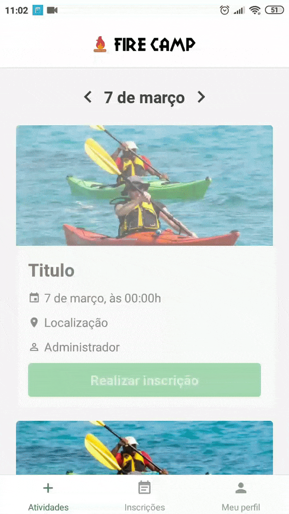

<h1 align="center">
 
  
 
 
FireCamp
</h1>

Mobile App for campers to subscribe for activities

  

  
  

## About the project

Mobile App of the **FireCamp System**. As a camper, you're able to do subscribe in activities.

To see the **api**, click here: [FireCamp Rest API](https://github.com/thiagodff/FireCamp-NodeJs)
 
To see the **instructor interface**, click here to take a look in the web aplicattion: [FireCamp Web](https://github.com/thiagodff/FireCamp-ReactJs')

## Features

This app features all the latest tools and practices development!

- [React Native](https://reactnative.dev/)
- [React Navigation](https://reactnavigation.org/)
- [Redux](https://redux.js.org/)
- [Redux-Saga](https://redux-saga.js.org/)
- [Redux-Persist](https://github.com/rt2zz/redux-persist)
- [Immer](https://immerjs.github.io/immer/docs/introduction)
- [Reactotron](https://github.com/infinitered/reactotron)
- [Prop-Types](https://github.com/facebook/prop-types)
- [Styled-Components](https://styled-components.com/)
- [Axios](https://github.com/axios/axios)
- [Date-fns](https://date-fns.org/)
- [ESLint](https://eslint.org/)

## Getting started

1. Clone this repo using `git clone https://github.com/thiagodff/FireCamp-ReactNative`
2. Move yourself to the appropriate directory: `cd FireCamp-ReactNative` 
3. Copy the .env.example `cp .env.example .env` and set the environment variable 
4. Run `yarn` to install dependencies 
5. Run `react-native run-android` (or `run-ios`) to start the mobile app 
6. Run `yarn start` to run the application

obs: make shure you have [api](https://github.com/thiagodff/FireCamp-NodeJs) running.

## Future

Create an administrative controller web page, be able to create and edit new plans for campers and enroll them. 
Create a mobile app for instructors. 
Show the current plan of the camper in your app.

- [x] Modify api
- [ ] Admin page
- [ ] Instructor app
- [ ] Modify camper app

## License

This project is licensed under the MIT License - see the [LICENSE](https://opensource.org/licenses/MIT) page for details.

---

Made with ♥ by Thiago :wave: [See my linkedin!](https://www.linkedin.com/in/thiago-fernandes-dornelles/)
